# AI Model Works

English · [中文 (earlier Astra-only list)](README.zh.md)

**Works that AI models actually produced:** demos and figures, each shown with a still and linked to its primary source, plus the prompt or brief where one was published. No third-party "I used model X to…" demos, no benchmark scoreboards, no journalism.

The repository slug `awesome-astra-science` dates from when this list covered GPT-6 Astra only. GPT-6 Astra is now one model section among others to come.

---

## How entries are organized

- **By model.** Each model has its own top-level section, named after the model and its maker.
- **By kind of work.** Within a model, works are grouped by kind (for example demos, 3D scenes, games), using only the kinds that model's material supports.
- **Each entry** shows a still from the repo's [`media/`](media/) folder, the source it comes from, any published prompt or brief, and one or two lines on what the model produced.
- Stills are frames or official assets. Copyright stays with the original authors (see [NOTICE](NOTICE.md)).

## Contents

- [GPT-6 Astra (OpenAI)](#gpt-6-astra-openai): 12 works
  - [Computer-use demos (launch page)](#computer-use-demos-launch-page): 5
  - [3D scenes and architectural visualization](#3d-scenes-and-architectural-visualization): 4
  - [Games](#games): 3
  - [Astra: out of scope](#astra-out-of-scope)
- [Adding a new model's works](#adding-a-new-models-works)

---

## GPT-6 Astra (OpenAI)

Only projects GPT-6 Astra itself produced: official OpenAI demos and write-ups where Astra builds an artifact.

Source of truth: [GPT-6 Astra launch](https://openai.com/index/gpt-6-astra/) and linked OpenAI posts.

### Computer-use demos (launch page)

#### Cell-tracking workflow (Jupyter)

<a href="https://openai.com/index/gpt-6-astra/">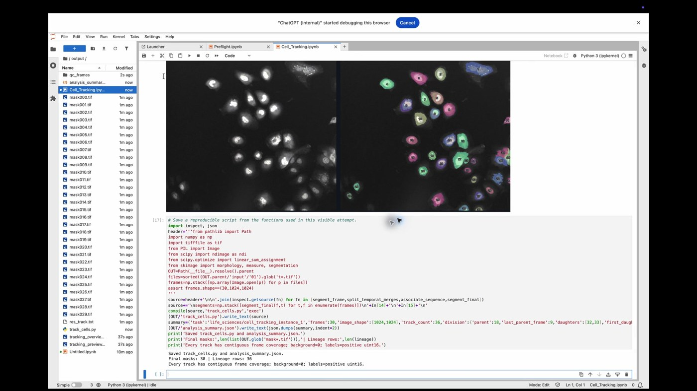</a>

**Source:** OpenAI · [launch · Cell-tracking workflow](https://openai.com/index/gpt-6-astra/)

Astra builds and runs a microscopy cell-tracking workflow in JupyterLab (masks → tracks / lineage). Condensed official computer-use demo, not a journal paper.

#### KiCad PCB (`chip_design`)

<a href="https://openai.com/index/gpt-6-astra/">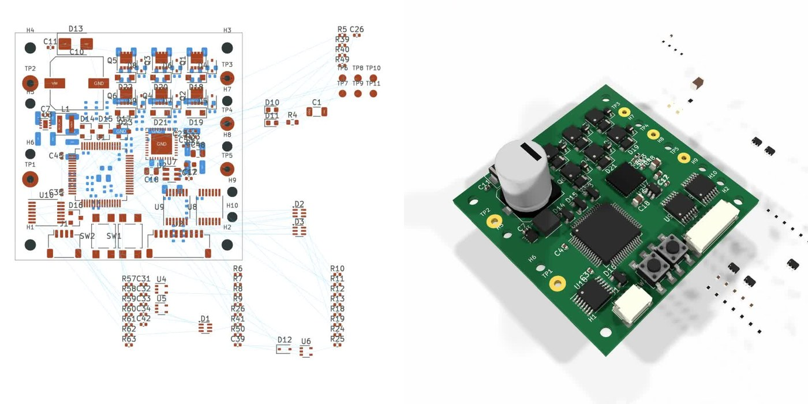</a>

**Source:** OpenAI · [launch](https://openai.com/index/gpt-6-astra/) · video `chip_design_no_captions_15s.mp4`

Astra places components and routes a manufacturable PCB in KiCad (2D layout + 3D board). This is the launch electronics desk, **not** MultiQC / sequencing QC.

#### FreeCAD five-speed transmission

<a href="https://openai.com/index/gpt-6-astra/">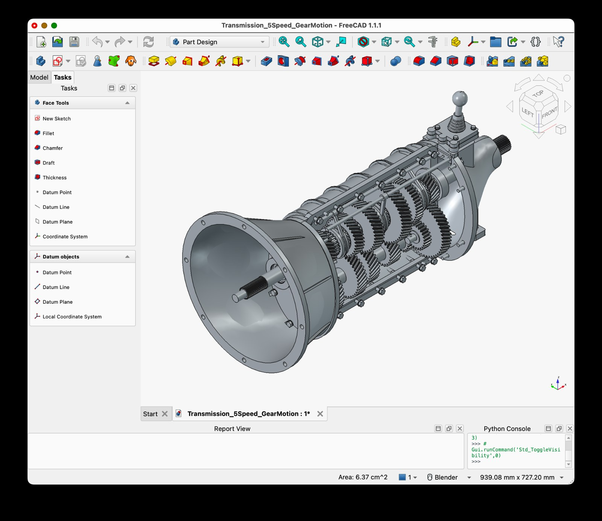</a>

**Source:** OpenAI · [launch · Car transmission](https://openai.com/index/gpt-6-astra/)

Written brief → detailed five-speed transmission concept in FreeCAD.

#### Gear motion (FreeCAD → Blender)

<a href="https://openai.com/index/gpt-6-astra/">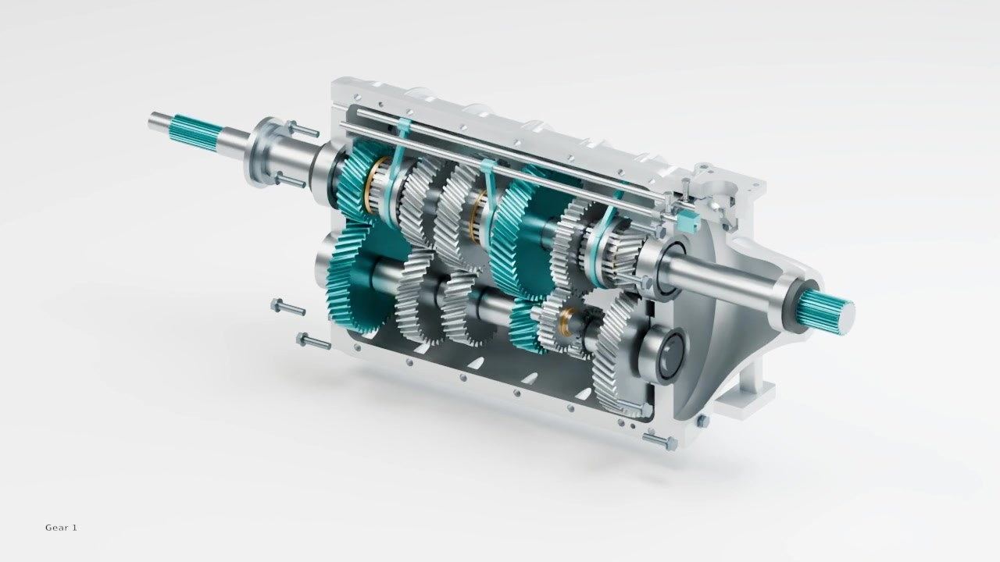</a>

**Source:** OpenAI · [launch](https://openai.com/index/gpt-6-astra/) · video `gear-motion.mp4`

Same transmission line: gears animated in motion (Blender follow-through on the FreeCAD design).

#### Unity city scene

<a href="https://openai.com/index/gpt-6-astra/">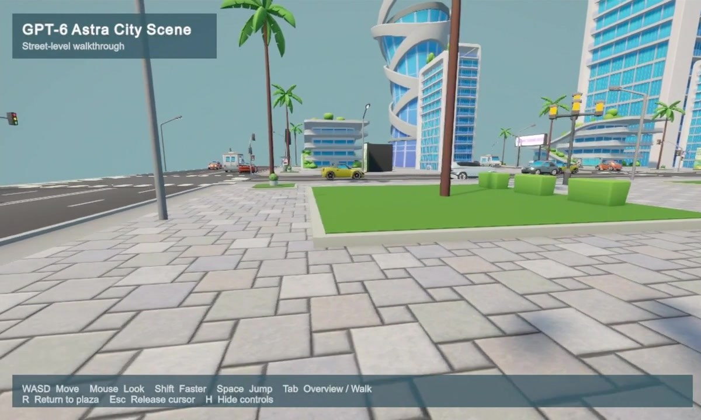</a>

**Source:** OpenAI · [launch](https://openai.com/index/gpt-6-astra/) · asset `Unity-City-high-res.png`

Aerial city scene assembled in Unity (official computer-use / game-assembly still).

### 3D scenes and architectural visualization

#### Solace house (Blender → Unreal)

<a href="https://developers.openai.com/blog/architectural-visualization-with-astra">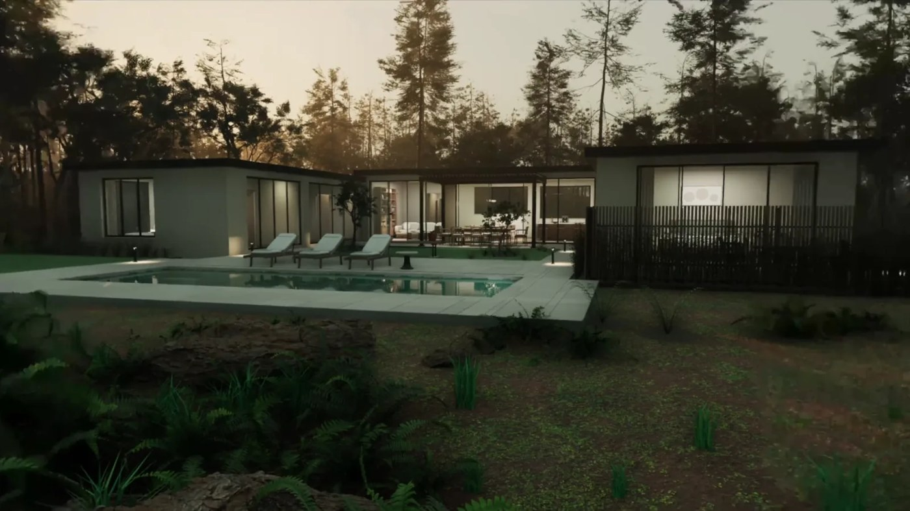</a>

<a href="https://developers.openai.com/blog/architectural-visualization-with-astra">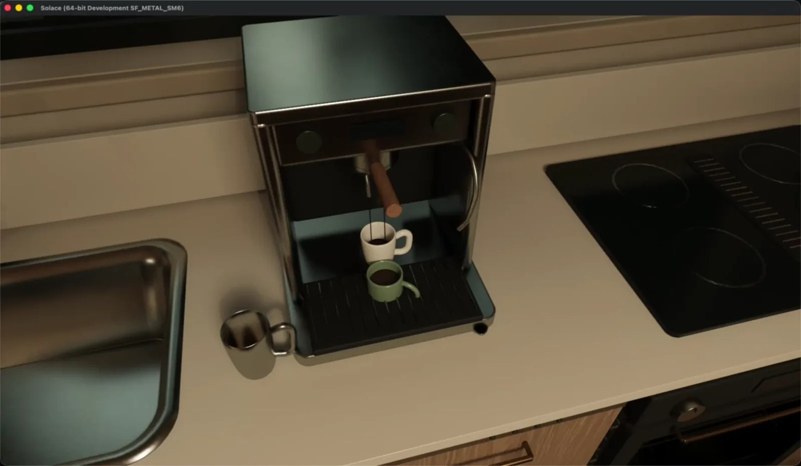</a>

**Source:** OpenAI Developers · [Architectural visualization with Astra](https://developers.openai.com/blog/architectural-visualization-with-astra)

Astra-driven arch-viz pipeline: research / modeling in Blender through to Unreal presentation (Solace).

#### HELIOS Dyson collector

<a href="https://developers.openai.com/blog/architectural-visualization-with-astra">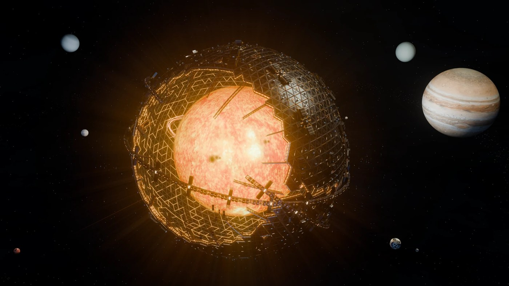</a>

**Source:** OpenAI Developers · same [architectural visualization](https://developers.openai.com/blog/architectural-visualization-with-astra) post

Concept build in the same official arch-viz write-up (HELIOS / Dyson-style collector).

#### Shipyard · AURELION-07 cruiser

<a href="https://developers.openai.com/blog/architectural-visualization-with-astra">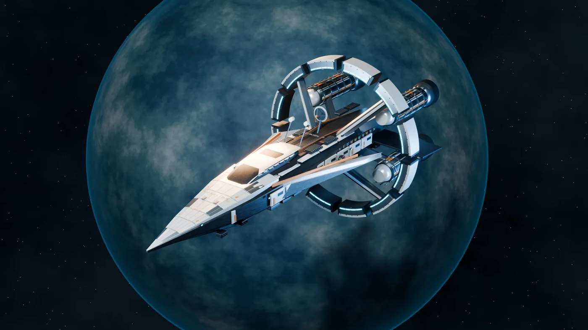</a>

**Source:** OpenAI Developers · [Architectural visualization with Astra](https://developers.openai.com/blog/architectural-visualization-with-astra)

Astra builds AURELION-07 in Blender (Shipyard project): tapered hull, segmented ring, four drives, all with editable geometry and materials.

#### Giverny water garden

**Source:** OpenAI Developers · [Architectural visualization with Astra](https://developers.openai.com/blog/architectural-visualization-with-astra)

Astra builds a Monet/Giverny-inspired garden scene (lily pond, bridge, planting) in the same official arch-viz write-up.

### Games

#### Void Explorer ship (Blender)

<a href="https://developers.openai.com/blog/how-to-build-games-with-astra">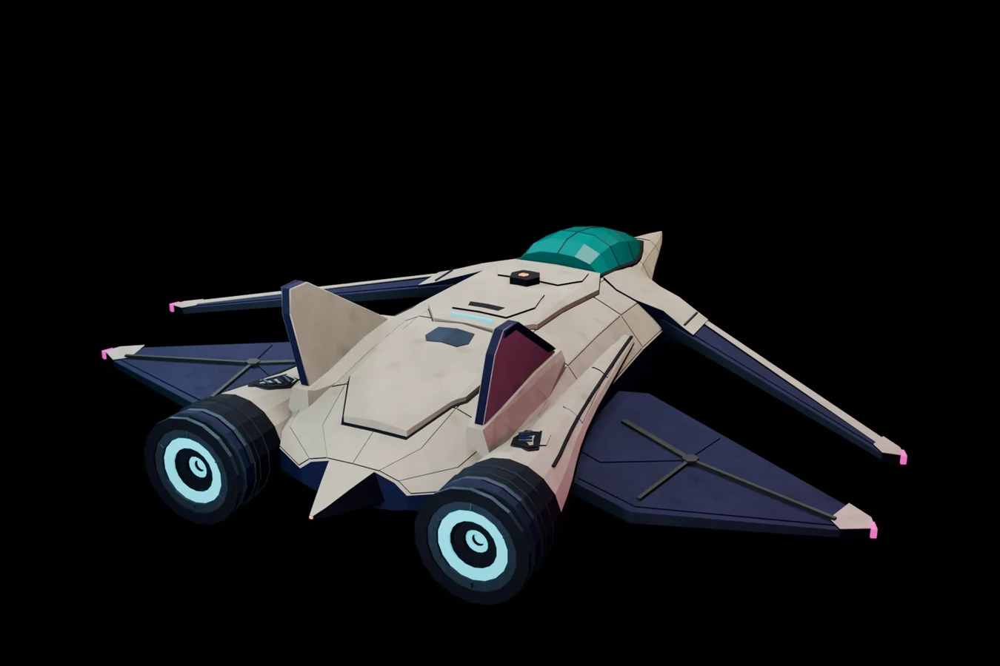</a>

**Source:** OpenAI Developers · [Building games with Astra](https://developers.openai.com/blog/how-to-build-games-with-astra)

Astra builds an editable Blender ship (AURORA: 193 meshes → runtime asset) for the Void Explorer game.

#### Sunwake ocean + boat

<a href="https://developers.openai.com/blog/how-to-build-games-with-astra">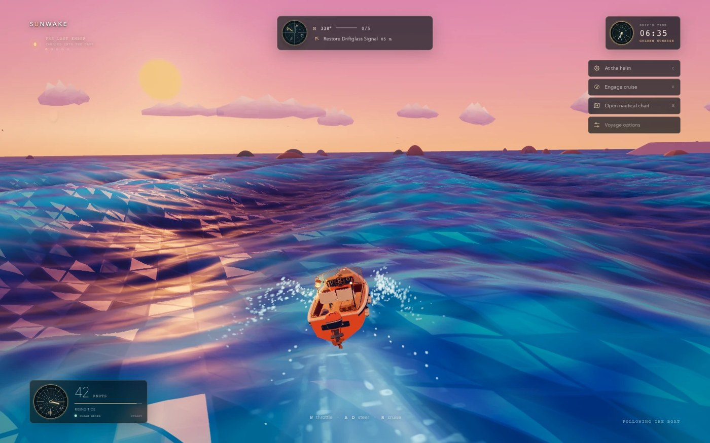</a>

**Source:** OpenAI Developers · same [games](https://developers.openai.com/blog/how-to-build-games-with-astra) post

Astra builds a custom Three.js water renderer and a Blender boat brought into Sunwake.

#### Hollowflux water RPG

<a href="https://developers.openai.com/blog/how-to-build-games-with-astra">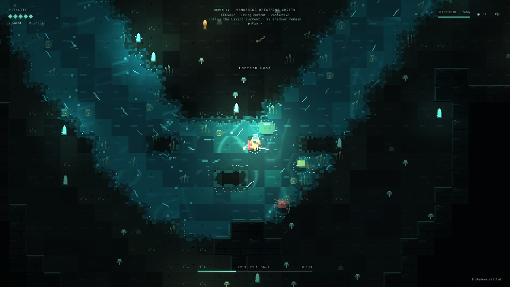</a>

**Source:** OpenAI Developers · [Building games with Astra](https://developers.openai.com/blog/how-to-build-games-with-astra)

Astra iterates a code-drawn 2D action RPG around a simulated underground river (water grid, currents, combat coupling).

### Astra: out of scope

Removed or never listed:

- Third-party X / blog "I used Astra to…" demos
- Benchmark tables (GeneBench, OSWorld, EEBench, …): scores, not projects
- Journalism / "reality check" rooms
- Wrong MultiQC attribution (never an Astra-built project; the launch electronics desk is KiCad)
- Ten Lean math essay (OpenAI text says **internal** Astra, not clearly public GPT-6 Astra builds)

Broader Astra link dump: [helloianneo/awesome-gpt6-astra](https://github.com/helloianneo/awesome-gpt6-astra).

---

## Adding a new model's works

This is a convention for future additions. There are no other model sections yet.

- **Section:** add a top-level `## <Model name> (<maker>)` section after the existing ones, with one line on what counts as that model's output and its primary source.
- **Kinds:** group works under `###` headings by kind (for example `Demos`, `Figures`, `3D scenes`, `Games`). Only add a kind when there is at least one real work for it.
- **Files:** put stills for a new model in `media/<model-slug>/<work-slug>.<ext>` (lowercase, hyphenated, e.g. `media/<model-slug>/<work-slug>.jpg`). Astra's existing stills stay at the top of `media/` so current links keep working.
- **Each entry lists:**
  - a `####` title naming the work;
  - a still or figure from this repo, linked to the source;
  - **Source:** the publisher and a link to the primary source (official page, paper, or repo) where the model produced the work;
  - **Prompt:** the published prompt or brief, quoted or linked, only when one exists;
  - one or two lines on what the model produced, with no metrics or claims beyond what the source shows.
- **Scope:** only works the model itself produced, with a primary source. No third-party social demos, benchmark score rows, or commentary.

---

**Curator:** [Xuzhen Li](https://github.com/Xuzhen-Li) · [ORCID](https://orcid.org/0000-0003-3670-6657) · Editorial text under [CC0 1.0](LICENSE); see [NOTICE](NOTICE.md).
