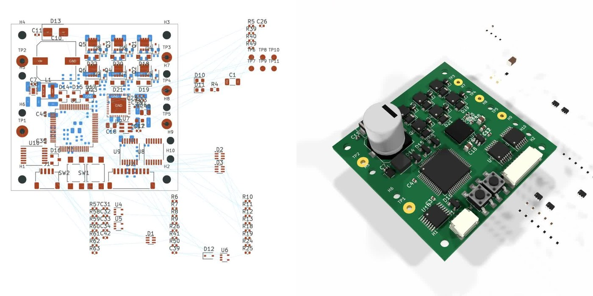

# Awesome Astra Science

[English](README.md) · 中文

**只收 GPT-6 Astra 自己做出来的项目**：OpenAI 官方演示 / 文章里，Astra 产出可指认的制品。不要第三方 X 演示，不要榜分数，不要新闻室。

依据：[GPT-6 Astra 发布页](https://openai.com/index/gpt-6-astra/) 及 OpenAI 官网文章。

---

## 官方产出

### 1 · 细胞追踪（Jupyter）

[发布页 · Cell-tracking workflow](https://openai.com/index/gpt-6-astra/) — 显微追踪工作流；官方电脑操控短片，不是论文。

### 2 · KiCad 电路板（`chip_design`）

[发布页](https://openai.com/index/gpt-6-astra/) — 原理图 → 可制造 PCB。**不是** MultiQC。

### 3 · FreeCAD 五速变速箱

[发布页 · Car transmission](https://openai.com/index/gpt-6-astra/)

### 4 · 齿轮运动（FreeCAD → Blender）

同线：`gear-motion.mp4`

### 5 · Unity 城市场景

官方 `Unity-City-high-res` 资产

### 6 · Solace 建筑可视化（Blender → Unreal）

[Architectural visualization with Astra](https://developers.openai.com/blog/architectural-visualization-with-astra)

### 7 · HELIOS Dyson 概念

同上官方建筑可视化文

---

## 已排除

第三方演示、榜、新闻、错安 MultiQC、以及原文写「内部版 Astra」的十项 Lean 数学文。

**整理：** [Xuzhen Li](https://github.com/Xuzhen-Li)
