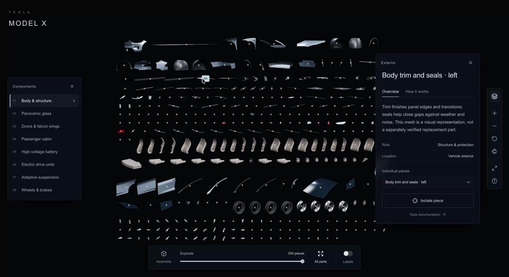
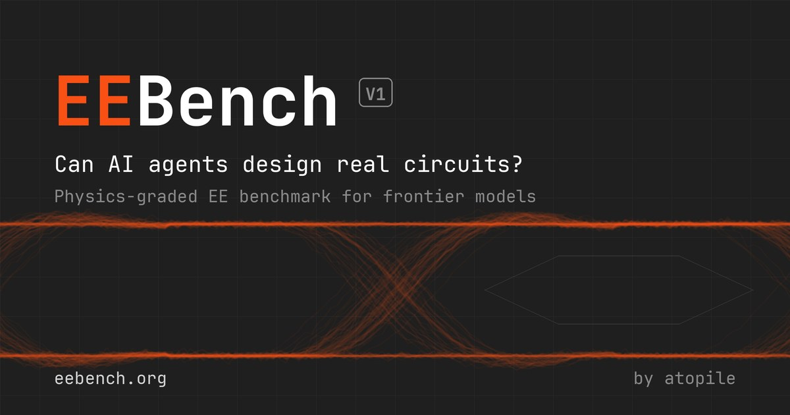
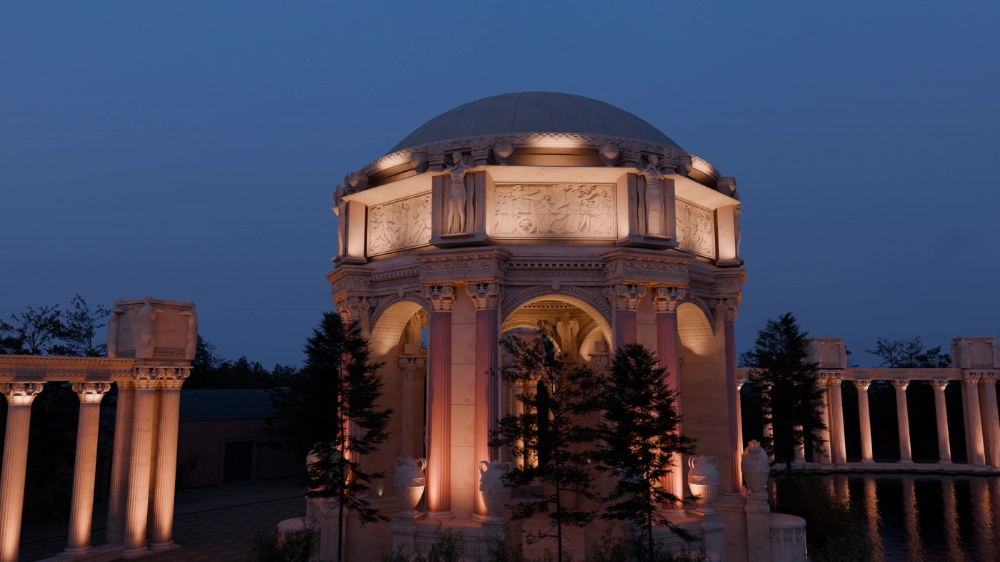
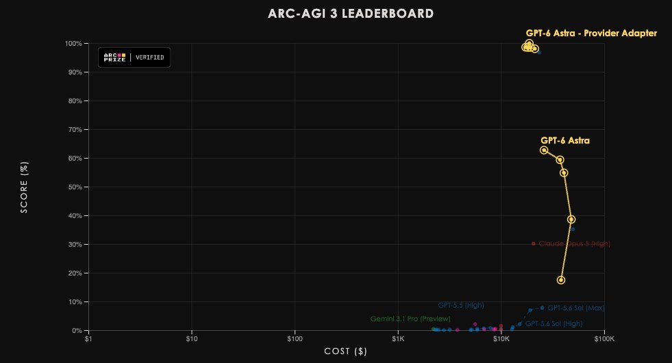
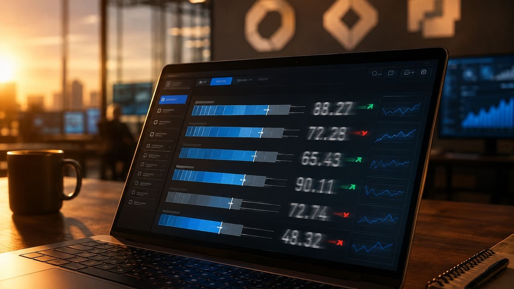
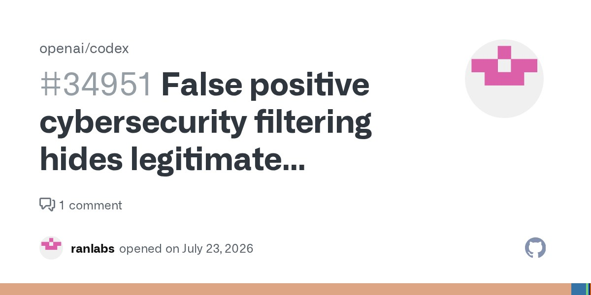
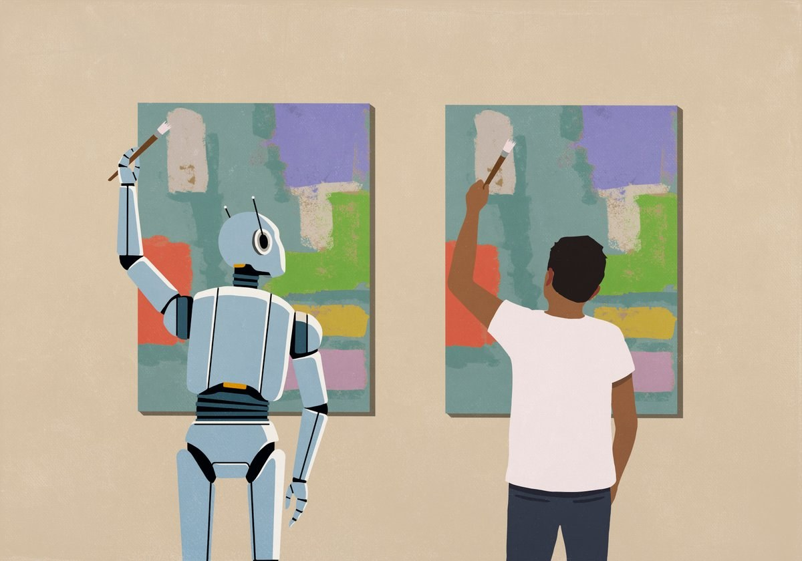
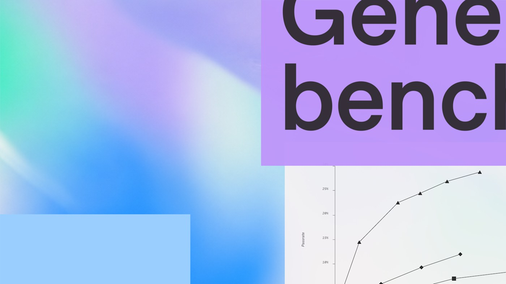
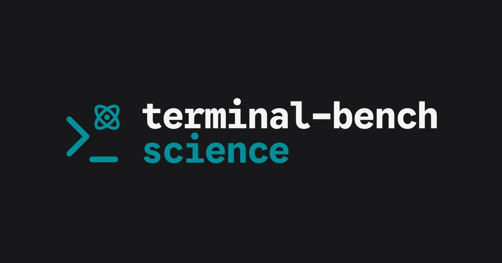

# Awesome Astra Science

[English promenade](README.md) · 中文游廊

面向科研与实验室工具的 **GPT-6 Astra 游廊**——按厅走动，一室一图。静帧与分数默认是演示 / 榜，**不是 Astra 写出了那门科学**；完整图文以英文游廊为准。

---

## 游廊地图

| 厅 | 气质 | 室 |
|----|------|----|
| [一厅 · 证明与官方工位](#一厅--证明与官方工位) | 正式结果 / 官方工位（≠做出科学） | 01–04 · 25 |
| [二厅 · 实验台](#二厅--实验台) | 实验室已有的 GUI | 05–10 · 26 · 52–57|
| [三厅 · 长程与警示](#三厅--长程与警示) | 连跑 / 别接活账号 | 11–14 |
| [四厅 · 离谱](#四厅--离谱) | 嵌套模拟 / 评测攻击 / Dyson | 15–24 |
| [五厅 · 也就那回事](#五厅--也就那回事) | 脚手架 / 改分 / 独立榜 | 27–61 |

---

## 一厅 · 证明与官方工位

### 室 01 · 细胞追踪（Jupyter）

[OpenAI](https://openai.com/index/gpt-6-astra/) · 发布页 **Cell-tracking workflow** 页签。官方电脑操控短片，不是已发表的细胞论文。

**已撤：** 原先 MultiQC / Bcftools 静帧属**错安**——发布页上没有 MultiQC，已从游廊删除。

### 室 02 · Ten Lean 数学 / TCS

[发布页](https://openai.com/index/ten-advances-in-mathematics/) · [ten-proofs](https://github.com/openai/ten-proofs)

### 室 03 · T 细胞免疫课

[Derya](https://x.com/DeryaTR_/status/2095659170661904804)

### 室 04 · FreeCAD 变速箱

---

### 室 25 · FrontierMath Erdős

Bloom 精选 68 道未解 Erdős；默认协议 Astra 仅 **3%**（2/68），额外尝试共 5 题。详见 [cases/math-research.md](cases/math-research.md)。

## 二厅 · 实验台

### 室 05–06 · KiCad

### 室 07–09 · 机械臂 / Onshape / Cinema 4D

见 [英文游廊](README.md#wing-ii--lab-desks)

### 室 10 · Notes + Blender

### 室 26 · 蒸汽机车 → 3295 个可编辑物体

### 室 52–54 · Tesla 334 件 / 照片→Blender 房 / Paint CU

牛逼：工程拆解与空间重建。翻车对照：室 55 Design Tasks **50%**。

### 室 56–57 · EEBench 69.3% / Fine Arts 过夜

独立电路榜第一；档案馆尺寸→Blender。

---

## 三厅 · 长程与警示

### 室 11 · 五天研究 wiki

### 室 13 · 连着 Gmail 发了邮件

见英文游廊 · [警示笔记](cases/cautionary.md)

---

## 四厅 · 离谱

### 室 15 · 套娃模拟世界

[somethingbig.ai](https://somethingbig.ai/astra-review)

### 室 16 · AISI 供应链攻击评测

### 室 18–19 · Solace 住宅 / HELIOS

### 室 20–24 · Unity 城 / 齿轮动画 / Canva / Path / YouTube 流水线

详见 [英文四厅](README.md#wing-iv--outrageous) 与 [cases/outrageous.md](cases/outrageous.md)。

---

## 五厅 · 也就那回事

<em>可以真的强，也别拿发布会上的那个数做预算。</em>

### 室 27 · ARC 脚手架 ≠ AGI

标准脚手架 **62.7%**，Provider Adapter **99.9%**。同权重。[ARC 博文](https://arcprize.org/blog/astra) · [笔记](cases/failures.md)

### 室 28–30 · 改分 / AA 61 / 发布翻车

独立 Intelligence Index **61**（与 Sol 持平），SciCode 科学 Python 掉 2–3 分。

### 室 31–34 · 误杀 / API 停摆 / 监控变脆 / AGI 话术

可靠性调试被 `cyber_policy` 连杀；API 任务直接停；自家说监控变脆。

### 室 35 · Ten-proofs 引用争议

Lean 过了 ≠ 文献规范过了。[SciAm](https://www.scientificamerican.com/article/openais-latest-math-breakthroughs-commit-research-misconduct-experts-say/) · [failures.md](cases/failures.md)。

### 室 36–42 · GeneBench / max_tokens / 机械臂 / HLE / 注入 / 拼图

官方 GeneBench 代理任务榜 **~37%**（不是 Astra 做出了基因组研究）；`max_tokens` 可被静默忽略；细操作拼图 2/20。

### 室 43–46 · TB-Science 脚手架差 / 薄增益 / Automation 41% / 编程王冠争议

公开榜顶端约 **30%**，OpenAI 表写 Astra **64.6%**——先问脚手架。

### 室 47–51 · 数据科学 40.9% / 幻觉 51% / 272K 陷阱 / OSWorld / ALE

内部数据科学不到一半；独立榜幻觉仍约半；上下文过 272K 整单涨价。详见英文五厅。

## 侧室

分类文件与 **生信缺口说明**（IGV / Scanpy / 公共 FASTQ）见 [cases/](cases/) 与英文 [Side rooms](README.md#side-rooms)。

维护：[Xuzhen Li](https://github.com/Xuzhen-Li)
