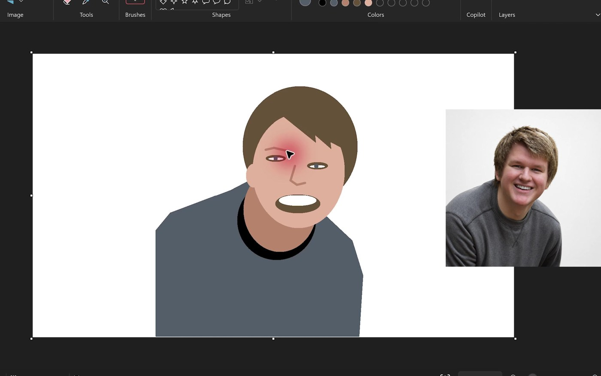

# Computer use (research-shaped)

Long sessions, screenshots, real GUIs. Games appear only when they stress the same control loop a lab session would.

## Catalog

### FireRed by pixels only

See [classics.md](classics.md) — 18h12m Astra vs longer Sol / unfinished GPT-5.5 (author-reported).

### Notes portrait

See [classics.md](classics.md) — stroke-level desktop control.

### Forms / booking / CRM (official)

- **Author:** OpenAI
- **Original:** https://openai.com/index/gpt-6-astra/
- **Date:** 2026-09-03
- Official computer-use chores (forms, calendar, CRM-like steps) in a demonstration environment.
- **Why here:** Template for “agent fills the boring GUI” — same class as LIMS and grant-portal chores, with the same oversight needs.

## MS Paint portrait (computer use)

- **Author:** The_Alex ([@The_Alex](https://x.com/The_Alex))
- **Original:** https://x.com/The_Alex/status/2095962639386239400
- **Date:** 2026-09-04
- **What it is:** Classic Paint-app likeness via mouse — widely cited CU motor-control check.
- **Why here:** Twin to Canva (Room 22); ImageJ/napari-class pixel habits.
- **Evidence boundary:** Author demo; not a science result.

## ScreenSpot-Pro · 92.7% dense-UI grounding

- **Author:** OpenAI (computer-use table)
- **Original:** https://openai.com/index/gpt-6-astra/
- **Date:** 2026-09-03
- **What it is:** Pixel/UI targeting **92.7%** vs Sol **76.9%** — the click layer under lab/CAD GUIs.
- **Why here:** Explains why KiCad/MultiQC/Notes demos look fluent.
- **Evidence boundary:** No-tools UI bench; ≠ scientific correctness.
