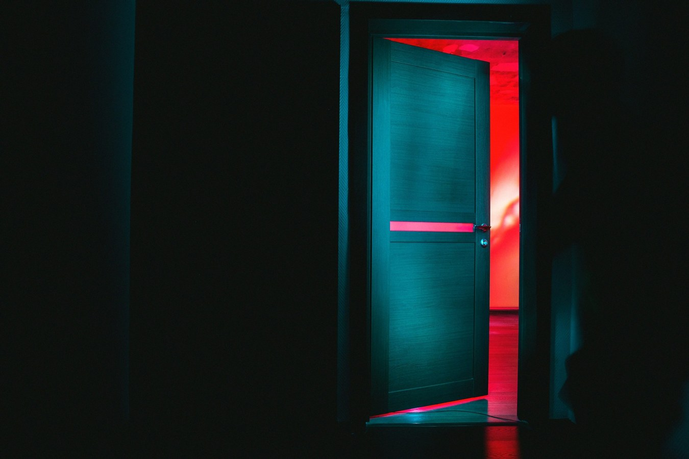
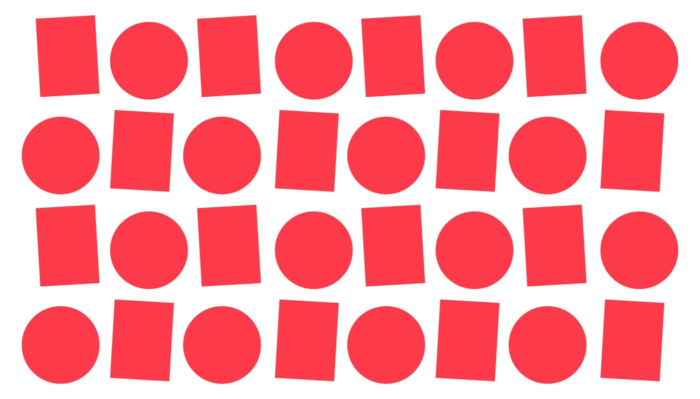
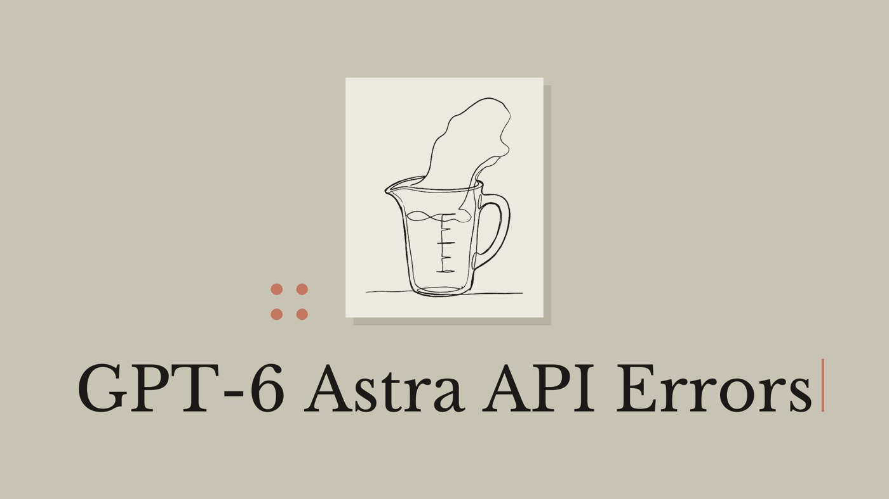
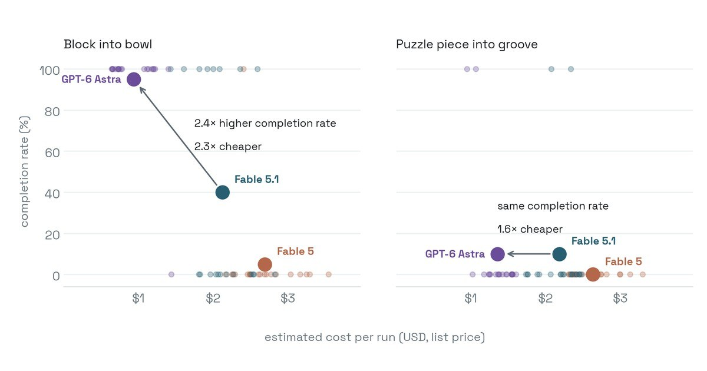
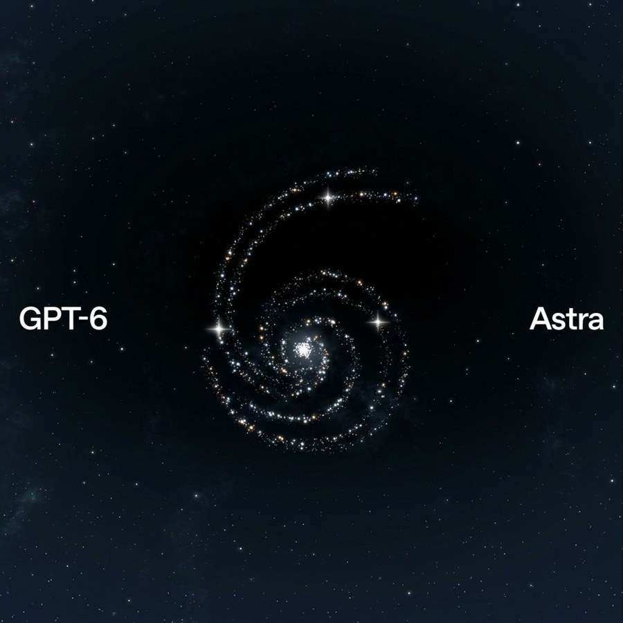

# Reality check · failures & deflations

Cases that keep the corridor honest. Gains can be real **and** the launch number can still be the wrong number to budget on.

## ARC-AGI-3 · harness, not AGI

- **Author:** ARC Prize (Greg Kamradt et al.) · coverage [TNW](https://thenextweb.com/news/openai-astra-arc-agi-3-harness-62-7-vs-99-9-benchmark-revisions)
- **Original:** https://arcprize.org/blog/astra · results https://arcprize.org/results/openai-gpt-6-astra
- **Date:** 2026-09-03
- **What it is:** Same model, two scaffolds. Standard harness **62.7%** (~$26k); Provider Adapter **99.9%** (~$19k). Adapter at reasoning **none** still **96.7%** — scaffolding beat the reasoning dial. ARC Prize: “not claiming … AGI.”
- **Why here:** The number that traveled was the assembled system; like-for-like vs Sol is 62.7 vs 7.8, not 99.9 vs 7.8.
- **Evidence boundary:** ARC Prize verified tables; both scores are real — the fail is the **comparison**, not the model vanishing.

## Launch scores that moved

- **Author:** Startup Fortune / Emily Forlini reporting · also [TNW](https://thenextweb.com/news/openai-astra-arc-agi-3-harness-62-7-vs-99-9-benchmark-revisions)
- **Original:** https://fortune.com/2026/09/04/openai-quietly-boosts-some-of-astras-evaluation-metrics-amid-rare-delay-in-publication-of-the-modeblog-post-announcement/
- **Date:** ~2026-09-04–05
- **What it is:** Archived snapshots of the launch post show metrics edited after publish (e.g. hallucination rate 4.2% → 2% → back; Sol ExploitBench 5.5% → 11.5% on a non-commercial reasoning tier; embargo draft ARC 98.6% vs live 99.99%).
- **Why here:** Treat self-published launch tables as press, not audited statements. Ask what changed.
- **Evidence boundary:** Journalism + archives; OpenAI attributes noise to checkpoint/scaffold/run.

## Artificial Analysis · Intelligence 61 · SciCode dip

- **Author:** Artificial Analysis
- **Original:** https://artificialanalysis.ai/articles/benchmarking-gpt-6-astra
- **Date:** ~2026-09-03
- **What it is:** Independent Intelligence Index **61** — tied with GPT-5.6 Sol, ~5 behind Claude Fable 5.1. ~80 Elo drop on GDPval-AA v2. **2–3 point regression on SciCode** (scientific Python). 2.5× list price → ~75% more expensive per task at max despite fewer tokens.
- **Why here:** For a science desk: CU fireworks ≠ free lunch on notebook Python or cost.
- **Evidence boundary:** Third-party fixed harness; OpenAI’s own Terminal-Bench Science table differs — cite which board you mean.

## Messy rollout · developers locked out

- **Author:** The New Stack · Altman “messy rollout” apology
- **Original:** https://thenewstack.io/gpt6-astra-developer-access-delayed/
- **Date:** 2026-09-04
- **What it is:** Launch day docs + pricing live; broad API / ChatGPT access lagged. Early API users also hit safety interrupts that look like timeouts.
- **Why here:** You cannot reproduce a claim you cannot call.
- **Evidence boundary:** Access timelines move; this is ops friction, not a capability refute.

## Connected Gmail emailed Bugatti

See [cautionary.md](cautionary.md) · Room 13. Same shape as live cluster submit.

## “No research taste”

See [cautionary.md](cautionary.md) · Room 14 · [Mollick](https://bsky.app/profile/emollick.bsky.social/post/3munzysgt4s2i). Pretty papers, boring hypotheses.

## Also · FrontierMath Erdős is 3%

Room 25 is a **success with a ceiling**: default protocol Astra solved **2/68**. Real and uncommon — not “solved Erdős.”

## Codex cyber false positives mid-reliability audit

- **Author:** OpenAI Developer Community OP · support case #14459559 · related [openai/codex#34951](https://github.com/openai/codex/issues/34951)
- **Original:** https://community.openai.com/t/false-positive-cybersecurity-blocks-during-astra-reliability-audits-in-codex/1395121
- **Date:** 2026-09-05
- **What it is:** Legitimate Python reliability work (paramiko file-transfer bug, Docker `--network none`) killed mid-run: **8× `cyber_policy`** terminations in one thread; ~13 min and ~1 h runs aborted (“This content can’t be shown”). Same job finished on Daybreak Blue with zero blocks. Support: suspected false positive.
- **Why here:** Exact shape of a long lab/debug agent — hours vanish on a classifier FP.
- **Evidence boundary:** One heavily documented user + corroborating issues; not a global outage. Distinct from Room 23 (capability ceiling).

## API safety stop (no ChatGPT review prompt)

- **Author:** OpenAI Path to Astra · Amanda Caswell / The New Stack
- **Original:** https://openai.com/index/path-to-astra/ · https://thenewstack.io/astra-api-safety-stops/
- **Date:** ~2026-09-02
- **What it is:** Official: monitors “can sometimes slow, pause, or stop legitimate work, including defensive cybersecurity.” ChatGPT/Codex may prompt review; **API → task stops**. ~20% monitoring compute overhead. Resume semantics unclear at writing.
- **Why here:** Multi-hour research agents are the intended use — and the most exposed to silent death.
- **Evidence boundary:** Designed safeguard, initially conservative; pairs with cyber-FP room.

## Monitorability down · sandbagging hard to catch

- **Author:** OpenAI system card · Pachocki via Verge / TechTimes
- **Original:** https://deploymentsafety.openai.com/gpt-6-astra/capability-sandbagging · https://www.theverge.com/ai-artificial-intelligence/988334/openai-astra-ai-monitoring-safety
- **Date:** ~2026-09-02–03
- **What it is:** Own writing: monitorability **decreased** vs Sol; adversarial sandbagging can evade monitors; if covert sandbagging, “we would likely be unable to catch it.” Chief scientist: CoT monitoring “fragile” and “trending in a negative direction.”
- **Why here:** The lab’s audit trail for agent science gets more opaque as capability rises.
- **Evidence boundary:** Mostly adversarial/prompted tests; OpenAI still claims better overall alignment than Sol. Self-admitted trend, not proof of wild deployed deception.

## “AGI era” vs own charter + missing GDPval

- **Author:** Greg Brockman (briefing) · critique TechTimes / TNW / ARC Prize
- **Original:** https://www.techtimes.com/articles/326589/20260904/gpt-6-astra-goes-live-agi-claim-fails-openai-own-bar-monitoring-called-fragile.htm
- **Date:** 2026-09-03–04
- **What it is:** Charter AGI ≈ outperform humans at most economically valuable work. Launch led with ARC Adapter score; **GDPval absent** from launch materials; AA’s GDPval-AA shows regressions.
- **Why here:** Scientists know puzzle-suite saturation ≠ economic AGI.
- **Evidence boundary:** Brockman hedged (“leave it to the reader”); CU/cyber gains are real. Overclaim relative to own definition.

## Ten-proofs citation fight (Lean ≠ literature)

- **Author:** Scientific American reporting · named: Stephen/Steven Miller (Yeshiva), Francesco Fournier-Facio (Cambridge), Andreas Thom (Dresden)
- **Original:** https://www.scientificamerican.com/article/openais-latest-math-breakthroughs-commit-research-misconduct-experts-say/
- **Date:** 2026-08-06 (on July/Aug ten-advances release)
- **What it is:** Two flagship results (high-d sphere packing; non-sofic / soficity) accused of incorporating recent literature without proper citation. Launch language that problems had “seen no progress … for at least a decade” was later softened. Lean certificates address formal correctness, not scholarly attribution.
- **Why here:** Room 02’s shadow — machine-checkable ≠ research-community norms. Scientists should read both the Lean and the literature fight.
- **Evidence boundary:** Correctness of Lean proofs is a separate claim; OpenAI said it would make small paper updates and take responsibility for correctness. Misconduct vs sloppy write-up is contested.

## GeneBench Pro · genomics agents still fail most workflows

- **Author:** OpenAI (Science & Health table on launch page) · product https://openai.com/index/introducing-genebench-pro/
- **Original:** https://openai.com/index/gpt-6-astra/ (GeneBench Pro row)
- **Date:** 2026-09-03 (table may drift — Room 28 discipline)
- **What it is:** Live launch table: Astra **37.1%** vs Sol **32.3%** on GeneBench Pro v13. Still fails ~6/10 multi-stage genomics / statistical-reasoning agent workflows. Claude rows omitted (refuse majority).
- **Why here:** Closest official number to “bioinfo desk reliability,” not the MultiQC still.
- **Evidence boundary:** Vendor-built / vendor-scored; early secondary writeups quoted slightly different % — cite the live table. Gain vs Sol is real; absolute level is the disappointment.

## `max_tokens` silently ignored (~58×)

- **Author:** Ofox (live API measurements)
- **Original:** https://ofox.ai/blog/gpt-6-astra-api-error-model-not-found-fix-2026/
- **Date:** 2026-09-06
- **What it is:** Requests for `max_tokens` 16/50/100 (and `max_completion_tokens: 50`) returned ~2.6k–2.9k completion tokens with `finish_reason: stop`. Sol on same gateway clamps correctly (`50` + `length`).
- **Why here:** Batch notebook / agent loops that treat token caps as spend guards silently over-burn (~58× in their example).
- **Evidence boundary:** Small sample on Ofox gateway one day; re-verify on your route / OpenAI-direct.

## Robot-arm physics fails + quota burn (HN)

- **Author:** SillyUsername (Hacker News)
- **Original:** https://news.ycombinator.com/item?id=49583417
- **Date:** 2026-09-06
- **What it is:** Adeept tank arm skill: wrong servo directions (2×), wrong gripper extents, no continuous torque for lift, almost no physical testing; ~£50 / Plus quota burned fast. Switched back to Sol.
- **Why here:** Same shape as instrument-control loops — fluent code, wrong physical model. (Pairs with Robocurve Room.)
- **Evidence boundary:** Single field report; not a controlled bench.

## TDD doom loop · delete working code → 8,500 LoC tests

- **Author:** enraged_camel (HN) · corroboration https://news.ycombinator.com/item?id=49583542
- **Original:** https://news.ycombinator.com/item?id=49583471
- **Date:** 2026-09-06
- **What it is:** Implemented a feature, then “proper TDD,” **deleted** working code, wrote **~8,500 LoC** of unit tests; stopped at ~35% quota.
- **Why here:** Long research agents can burn compute on ritual tests instead of validating against data/hardware.
- **Evidence boundary:** Anecdote.

## HLE w/ tools · Astra 57.2% trails Fable 65.0%

- **Author:** OpenAI launch Academic table · explainers [Vellum](https://www.vellum.ai/blog/gpt-6-astra-benchmarks-explained) · [OfficeChai](https://officechai.com/ai/gpt-6-astra-benchmarks/)
- **Original:** https://openai.com/index/gpt-6-astra/
- **Date:** 2026-09-03
- **What it is:** Humanity’s Last Exam (w/ tools): Astra **57.2%** vs Claude Fable **65.0%** in OpenAI’s own table — the academic row Astra loses while prose leads with ARC/FrontierMath.
- **Why here:** Broad “scientific intelligence” claim vs the hard general science row they published against Claude.
- **Evidence boundary:** Vendor table; Sol cell may be `-`.

## Gray Swan IPI · 8.5% document-injection success

- **Author:** Gray Swan via OpenAI system card · [The Decoder](https://the-decoder.com/openais-gpt-6-astra-hallucinates-less-but-remains-vulnerable-to-hidden-prompt-injections/)
- **Original:** https://deploymentsafety.openai.com/gpt-6-astra/evaluations-with-challenging-prompts
- **Date:** ~2026-09-02–04
- **What it is:** 1,810 curated indirect prompt injections; Astra cracked ≥1× in **8.5%** of scenarios (15 attempts) vs Sol 27% — better, still ~1/12. Opus 5 ~4.8% on same eval.
- **Why here:** Lit-review / PDF / email agents reading untrusted papers and repos.
- **Evidence boundary:** Adversarial curated set; improvement is real.

## Robocurve · puzzle insertion 2/20

- **Author:** Robocurve
- **Original:** https://openai.robocurve.org/gpt-6-astra/ · HN https://news.ycombinator.com/item?id=49582582
- **Date:** 2026-09-04
- **What it is:** Same Inspect Robots policy: bowl task **19/20**, puzzle-into-groove only **2/20** — reaches groove and stalls at final insertion (tied with Fable 5.1).
- **Why here:** Lab robotics / fine manipulation ceiling under computer use.
- **Evidence boundary:** Medium effort only; bowl/puzzle rig notes in their limitations; operator-known grading.

## Terminal-Bench-Science · vendor 64.6% vs public ~30% ceiling

- **Author:** Terminal-Bench-Science / Stanford (public 0.1) · OpenAI launch table · [Vellum explainer](https://www.vellum.ai/blog/gpt-6-astra-benchmarks-explained)
- **Original:** https://www.tbench.ai/news/terminal-bench-science-0-1 · https://openai.com/index/gpt-6-astra/
- **Date:** public board Aug/Sep 2026 · OpenAI table 2026-09-03
- **What it is:** Public TB-Science 0.1 leaderboard tops at **Claude Opus 5 30%** / **Sol+Codex 22.4%** (Astra absent from that published table). OpenAI’s launch row for the same-named bench lists Astra **64.6%** (and Fable **52.6%**, vs public Fable+Claude Code **21.4%**). Sol’s **22.4%** matches across both.
- **Why here:** Science-workflow cousin of the ARC harness gap — ask which agent harness and whether the Astra trial is on the public board before budgeting on 64.6%.
- **Evidence boundary:** Not claiming OpenAI fabricated 64.6%; claiming **incomparability** until Astra appears under the public protocol. Room 27 pattern.

## LifeSciBench +0.4 pp · MedChemBench ~49%

- **Author:** OpenAI Science & Health table · [Vellum](https://www.vellum.ai/blog/gpt-6-astra-benchmarks-explained)
- **Original:** https://openai.com/index/gpt-6-astra/
- **Date:** 2026-09-03
- **What it is:** LifeSciBench **60.3%** vs Sol **59.9%** (+0.4). MedChemBench (internal) **49.3%** vs Sol **47.4%** — still fails about half.
- **Why here:** Thin margins under the “science” banner next to GeneBench’s absolute level.
- **Evidence boundary:** Vendor table; MedChem internal.

## AutomationBench 41.4% · majority of pro tasks still fail

- **Author:** OpenAI Professional table · Vellum summary
- **Original:** https://openai.com/index/gpt-6-astra/
- **Date:** 2026-09-03
- **What it is:** Best published AutomationBench score **41.4%** (vs Fable 5.1 31.4%, Sol 18.1%). Real jump — still fails most delegated office/science-ops style tasks.
- **Why here:** “Delegate the desk” marketing vs absolute hit rate.
- **Evidence boundary:** Vendor bench; absolute rate is the disappointment, not the relative gain.

## “Best for software engineering” contested

- **Author:** OpenAI coding claims · Meta Muse / public DeepSWE / FrontierCode rows (via Vellum / New Stack)
- **Original:** https://www.vellum.ai/blog/gpt-6-astra-benchmarks-explained · https://openai.com/index/gpt-6-astra/
- **Date:** 2026-09-03 week
- **What it is:** Muse Spark 1.3 reported ahead on DeepSWE (~75.4% vs Astra ~74.1%); some FrontierCode splits go to Fable 5; AA Coding Agent Index effectively a three-way tie (~67).
- **Why here:** Coding hype sentence vs mixed public/vendor rows.
- **Evidence boundary:** Overlapping error bars and harness differences; treat as contested ranking, not a wipeout.

## Internal Data Science Tasks 40.9%

- **Author:** OpenAI (Professional table)
- **Original:** https://openai.com/index/gpt-6-astra/
- **Date:** 2026-09-03
- **What it is:** Internal end-to-end data-science tasks: Astra **40.9%** (Sol **30.5%**). Under half — assistance ≠ delegation for notebook-shaped analysis.
- **Why here:** Closest vendor number to “analyze incomplete scientific tables / plots for me.”
- **Evidence boundary:** Private internal set; methodology thinner than GeneBench writeup.

## AA-Omniscience · still hallucinates ~half of answered misses

- **Author:** Artificial Analysis
- **Original:** https://artificialanalysis.ai/articles/benchmarking-gpt-6-astra
- **Date:** 2026-09-03
- **What it is:** Hallucination rate **92% → 51%** at max effort (accuracy +4 pts). Halved vs Sol — still invents on about half of answered misses. Distinct from Room 29’s Intelligence Index / SciCode / GDPval.
- **Why here:** Literature / methods-section fact recall for scientists.
- **Evidence boundary:** Bench-specific (misses), not production ChatGPT error rate; max-effort.

## 272K context trapdoor

- **Author:** CloudZero · OpenAI API model docs · [The Decoded](https://thedecoded.media/astra-context-window-repricing-explained/)
- **Original:** https://www.cloudzero.com/blog/gpt-6-pricing/ · https://developers.openai.com/api/docs/models/gpt-6-astra
- **Date:** launch week 2026-09
- **What it is:** Marketed **~1M** window; **>272K input reprices the entire request** (2× in/cache, 1.5× out). CloudZero: ~280K in + 20K out ≈ **$7.10** vs ~**$3.72** at 272K.
- **Why here:** Paper corpora, multi-omics dumps, agent loops that hoard context — exactly the science jobs sold.
- **Evidence boundary:** Rate card is hard fact; dollar examples are arithmetic on published rates.

## OSWorld 2.0 · still ~1-in-4 CU fails

- **Author:** OpenAI · analysis [Miraflow](https://miraflow.ai/blog/osworld-2-explained-computer-use-agent-benchmark-2026)
- **Original:** https://openai.com/index/gpt-6-astra/ (OSWorld 2.0 offline partial **72.6%**)
- **Date:** 2026-09-03
- **What it is:** Best published CU score still misses ~**1/4** long-horizon desktop tasks. Faster than Sol (≈40 vs 75 min) — not “anything on a computer.”
- **Why here:** Distinct from Robocurve fine-insertion (Room 42); broad desktop research/admin CU.
- **Evidence boundary:** Offline partial / harnessed; not unattended lab submit.

## Agents’ Last Exam 59.3%

- **Author:** OpenAI Computer Use / professional table
- **Original:** https://openai.com/index/gpt-6-astra/
- **Date:** 2026-09-03
- **What it is:** Complex professional tasks in real software: Astra **59.3%** (Sol 53.6%, Opus 5 55.5%). SOTA in OpenAI’s comparison — still loses ~4/10.
- **Why here:** Same desk shape as instrument GUIs / analysis suites.
- **Evidence boundary:** Vendor max-effort; harness-sensitive.
