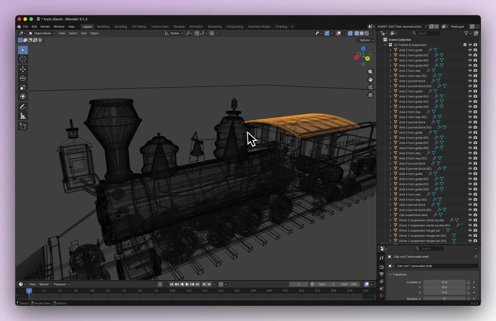

# Lab tooling and EDA

Desktop apps a scientist or engineer actually opens. Prefer KiCad / CAD / analysis GUIs over chat-only answers.

## Catalog

### Official KiCad PCB layout

- **Author:** OpenAI
- **Original:** https://openai.com/index/gpt-6-astra/
- **Date:** 2026-09-03
- **Also listed in:** [awesome-gpt6-astra](https://github.com/helloianneo/awesome-gpt6-astra)
- Astra operates KiCad: place components, route copper from a schematic. Condensed official playback.
- **Evidence boundary:** Official demo. Not an independent fab validation.
- **Related reading:** [EEBench on whether AI can design boards yet](https://eebench.org/blog/can-ai-design-circuit-boards-yet/) — measurement mindset for “demo vs correct circuit.”

### GoFly drone PCB (user)

See [classics.md](classics.md) — independent KiCad echo with explicit “still needs an engineer” boundary.

### ChihYang04 KiCad routing (user)

See [classics.md](classics.md).

### Agentic CAD

See [classics.md](classics.md).

## Wanted (open slots)

- RStudio / Positron: QC plot loop on a public RNA-seq toy table
- IGV or JBrowse: navigate a public VCF/BAM and export a region figure
- ImageJ / Fiji: batch measure a public microscopy set
- draw.io / Illustrator: object-level scientific figure repair (not a flat redraw)

## Steam drawing → 3,295 editable Blender objects

- **Author:** Tom Krcha ([@tomkrcha](https://x.com/tomkrcha))
- **Original:** https://x.com/tomkrcha/status/2095756085890310311
- **Date:** 2026-09-04
- **What it is:** Old technical drawing → minutes later thousands of fully editable Blender objects (not one fused mesh).
- **Why here:** Decomposable CAD/geometry for engineering / instrument modeling.
- **Evidence boundary:** Author-reported count/time/cost; quality subjective.
