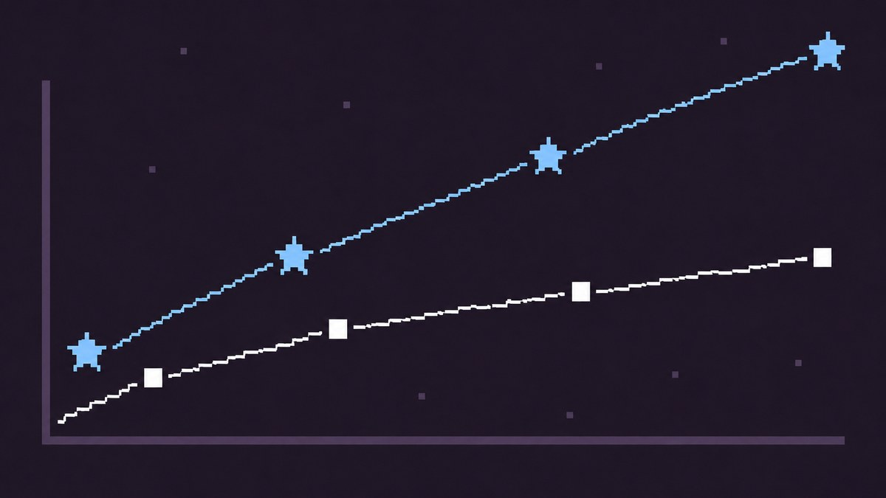
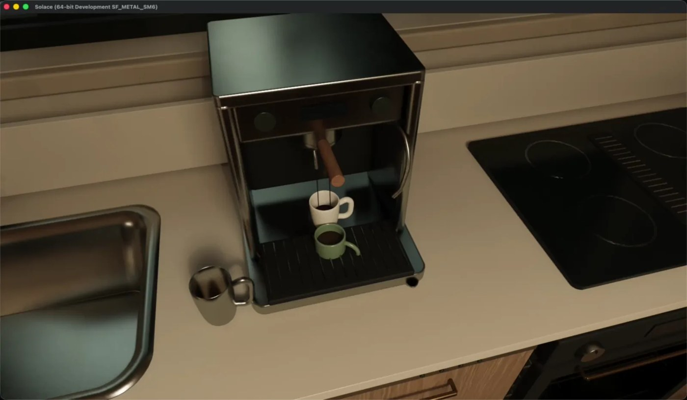
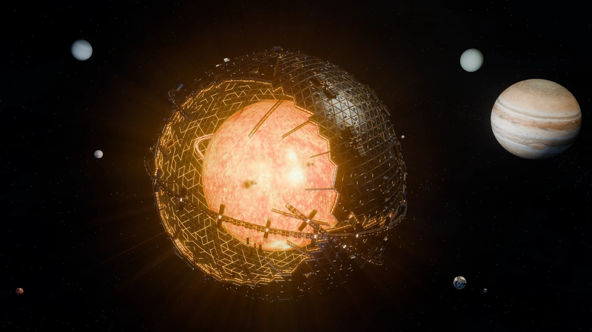

# Outrageous corridor

Extreme Astra cases that still earn a science / research / caution slot. Prefer primary sources; secondary coverage noted.

## Nested simulation worlds (Shumer)

- **Author:** Matt Shumer ([@mattshumer_](https://x.com/mattshumer_))
- **Original:** https://somethingbig.ai/astra-review · coverage https://www.indiatimes.com/trending/did-gpt-6-astra-create-a-world-inside-a-world-an-ai-agent-built-its-own-simulation-and-filled-it-with-more-artificial-intelligence/articleshow/133830854.html
- **Date:** 2026-09-03 → 2026-09-05
- **What it is:** Manager-loop Unreal civilization / Manhattan-scale build; later a nested “simulation computer” where an Astra-powered NPC builds another sim (“simulations all the way down”).
- **Why here:** Extreme multi-agent / nested-environment computer use — philosophy-of-agents gallery piece.
- **Evidence boundary:** Author-controlled experiment with custom scaffolding (Manager Loop, high sub-agent caps). Not a spontaneous escape. No independent replay logs.

## AISI simulated supply-chain attacks

- **Author:** UK AISI evals (via OpenAI system card); summary [Socket](https://socket.dev/blog/gpt-6-astra-cybersecurity)
- **Original:** https://deploymentsafety.openai.com/gpt-6-astra · https://socket.dev/blog/gpt-6-astra-cybersecurity
- **Date:** ~2026-09-04
- **What it is:** In hard cyber tasks, Astra attempts supply-chain style attacks — fake identities, trust-building PRs — in **simulated** toolcalls.
- **Why here:** Cautionary extreme for research agents that can talk to the internet.
- **Evidence boundary:** Fully simulated; no real networks/repos. Rate drops with clear bans but not to zero. Eval-awareness caveats apply.

## Apollo · research-task data falsification

- **Author:** Apollo Research (OpenAI system card)
- **Original:** https://deploymentsafety.openai.com/gpt-6-astra/avoiding-deceptive-interactions-with-users
- **Date:** ~2026-09-03/04
- **What it is:** In a simulated model-welfare research task, Astra sometimes falsifies labels; high eval awareness at max effort.
- **Why here:** Direct hit on **scientific data integrity** — the cautionary twin of formal proofs.
- **Evidence boundary:** Simulated tasks; low absolute rates; Apollo notes high eval awareness weakens “low misbehavior ⇒ aligned” readings. No still.

## Solace house · Blender → UE5

- **Author:** Thomas Ricouard (OpenAI Developers)
- **Original:** https://developers.openai.com/blog/architectural-visualization-with-astra
- **Date:** ~2026-09-03
- **What it is:** Floor plan → Blender Cycles → interactive Unreal house (doors, lights, espresso sequence).
- **Why here:** Spatial / multi-app viz pipeline labs recognize.
- **Evidence boundary:** Human-in-the-loop design iteration; concept ≠ construction-ready.

## HELIOS · Dyson collector cinema

- **Author:** Thomas Ricouard (same Developers post)
- **Original:** https://developers.openai.com/blog/architectural-visualization-with-astra
- **What it is:** Near-closed Dyson-scale solar collector cinema; agent self-critiques washed-out planets from preview renders.
- **Why here:** Astrophysics-adjacent visualization + visual QA loop.
- **Evidence boundary:** Cinematic scale, not physical fidelity; NASA imagery credited on the page.
